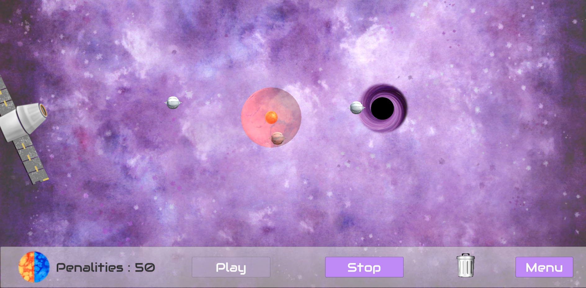
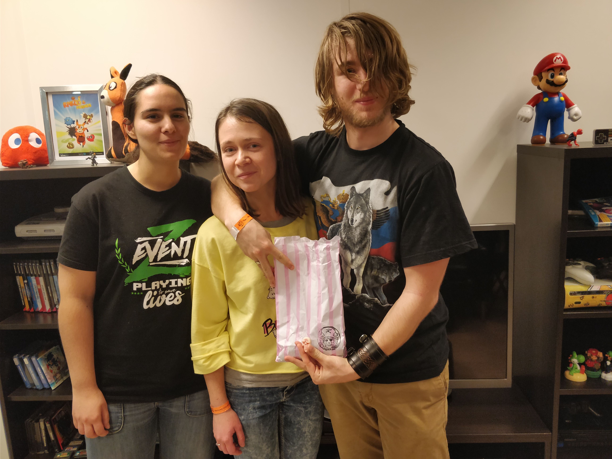

# GGS-2018-Magnet

Game realized with Unity during the Global Game Jam 2018 at Old Skull Games

## The concept
It's a puzzle game where you have to shoot drone into a black hole. To do that you will have to use the attraction and repulsion of the red and blue dwarves.

## Team

Gwendoline GOMEZ
Maria KAPTUR
Mathieu NIVOLIEZ

## Key points
* Painted texture (Maria KAPTUR)
* Mouth sounds
* Simple mechanics.
